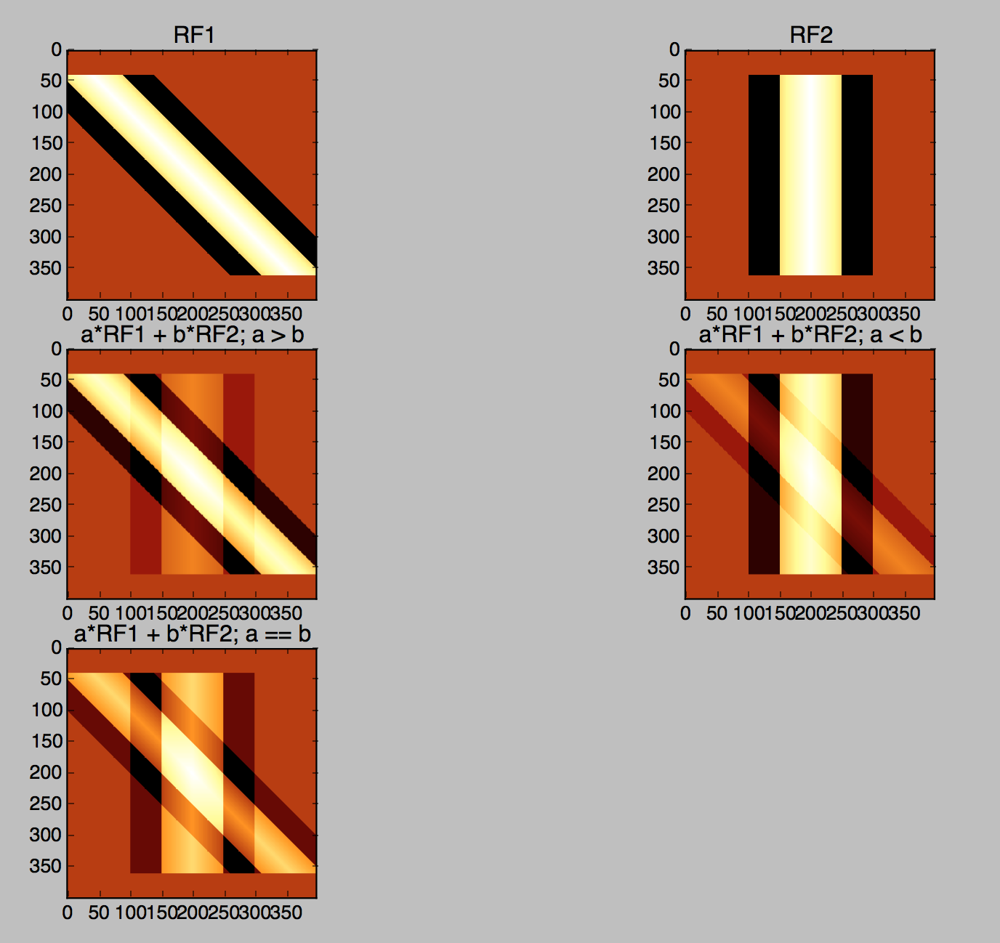

# ComputationalNeuroscience---Receptive-Field-Modeling

After a long walk home thinking about visual receptive fields, I wondered how I might visualize this phenomenon. I chose matplotlib via Python to create a simple model of the receptive fields of the visual field modeled at the level of the Lateral Geniculate Nucleus (LGN) projecting to the primary V1 wherein combinations of neural clusters capture light angles and combine with various weights to produce an emergent visual representation. Essentially, it is looking at the combination of differentially weighted receptive fields that capture different angles of light projecting from the LGN to the V1, resulting in variable emergent representations of patterns observed within the visual field.

This was a quick and dirty 10 minute coding exercise to lend some firmer context to random thoughts on visual perception. I'll be interested in pursuing these ideas in greater detail at a later date.

</img>
